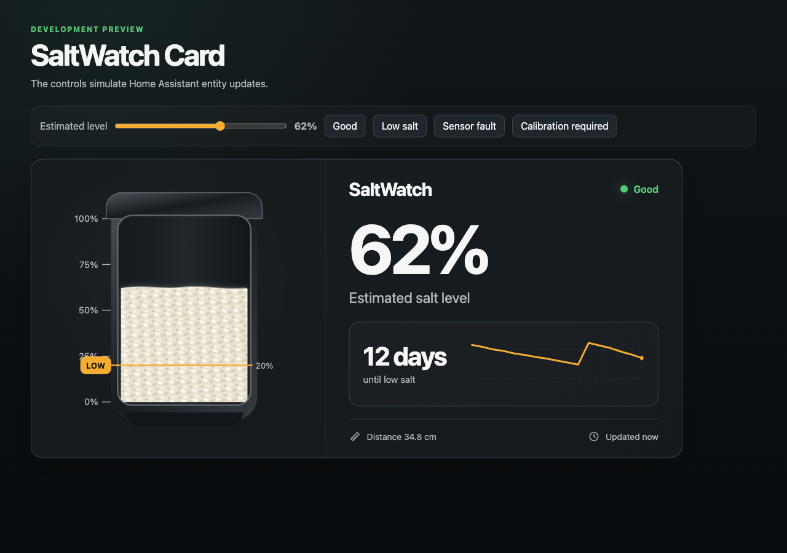

# SaltWatch Card

**A purpose-built Home Assistant card for seeing your estimated water-softener
salt level as a physical, granular tank.**

SaltWatch Card turns a percentage sensor into a granular brine-tank
visualization. The salt surface moves with the measured level, stays uneven so
it reads as salt rather than liquid, and includes a precise scale and visible
low-salt threshold.

The card intentionally focuses on the visualization Home Assistant does not
already provide. Use native Tile and Statistics Graph cards for controls,
forecast, distance, and history.

The card is designed for [SaltWatch](https://github.com/thomasgregg/saltwatch)
but works with any numeric percentage sensor.



> [!IMPORTANT]
> The card visualizes the value supplied by the selected entity. SaltWatch's
> value is an **estimated percentage of the calibrated vertical range**, not a
> direct measurement of salt mass or volume.

## Current status

SaltWatch Card is under active development. The focused tank card, graphical
editor, responsive layout, configurable Home Assistant actions, localization,
and explicit unavailable states are implemented.

## Features

- Bright, realistically scaled compressed salt tablets with an uneven top surface
- Detailed molded tank, lid, window, base, and material shading
- Major, medium, and minor percentage scale ticks
- Exact 0–100% vertical positioning from the selected entity
- Dynamic low-salt threshold marker
- `Good`, `Low Salt`, `Calibration Required`, and `Sensor Fault` states
- Explicit `No current reading` presentation instead of a frozen old level
- Responsive desktop, tablet, and narrow dashboard layouts
- Automatic Home Assistant light, dark, and custom-theme colors
- Home Assistant card-picker registration and graphical configuration form
- Configurable tap, hold, and double-tap Home Assistant actions
- English and German built-in labels, including accessible SVG descriptions
- Keyboard-accessible tap action
- No recorder calls or duplicate chart/control implementations

## Development preview

```bash
npm install
npm run dev
```

Open `http://127.0.0.1:5173/demo/`. The preview controls simulate level, low
salt, sensor fault, calibration states, and Home Assistant-style light and dark
themes.

## Build and test

```bash
npm run check
npm run test:e2e
```

To exercise an installed card against a real Home Assistant dashboard, save an
authenticated Playwright storage state and run:

```bash
HA_URL="https://home-assistant.example/dashboard/view" \
HA_STORAGE_STATE=".auth/home-assistant.json" npm run test:ha
```

The production file is written to the stable `dist/saltwatch-card.js` filename
used by HACS releases.

## HACS installation

Add this repository as a custom **Dashboard** repository in HACS, install
**SaltWatch Card**, and reload Home Assistant. For local development, build the
card and copy `dist/saltwatch-card.js` to Home Assistant's
`/config/www/saltwatch-card/` directory, then add it under **Settings →
Dashboards → Resources**:

```text
/local/saltwatch-card/saltwatch-card.js
```

Select **JavaScript module**, reload the browser, then choose **SaltWatch Card**
from the dashboard card picker.

## Configuration

```yaml
type: custom:saltwatch-card
entity: sensor.saltwatch_salt_level
status_entity: sensor.saltwatch_salt_status
threshold_entity: number.saltwatch_low_salt_threshold
```

Only `entity` is required.

In Home Assistant sections dashboards, the card uses the full section width and
lets its content determine the height. This keeps the stacked mobile layout from
being clipped by fixed grid rows.

| Option | Description | Default |
| --- | --- | --- |
| `entity` | Percentage sensor controlling the salt surface | Required |
| `show_status` | Show the upper-right status indicator | `true` |
| `show_low_marker` | Show the low-marker summary beneath the percentage; the tank's LOW line and badge remain visible | `true` |
| `display_mode` | Show `both`, `tank`, or `details` content | `both` |
| `status_entity` | Text status such as `Good` or `Sensor Fault` | Derived from level |
| `threshold_entity` | Number entity controlling the low marker | None |
| `low_threshold` | Marker used when no threshold entity is supplied | `20` |
| `tap_action` | Home Assistant action performed on tap or keyboard activation | `more-info` |
| `hold_action` | Home Assistant action performed after holding | `none` |
| `double_tap_action` | Home Assistant action performed on double tap | `none` |

The visibility options can be combined independently:

```yaml
show_status: false
show_low_marker: false
display_mode: tank
```

The status and threshold accents use Home Assistant's native theme colors:
`--success-color` for a good reading, `--warning-color` for low salt and
calibration, and `--error-color` only for a sensor fault. The physical tank
remains a stable light neutral illustration, while the card surface, text,
dividers, and status states update automatically with the active theme.

## Recommended native dashboard composition

Keep SaltWatch Card focused on the tank and let Home Assistant render the
controls, supporting sensor values, and history. This preserves native theming,
editing, actions, accessibility, and recorder behavior.

```yaml
type: vertical-stack
cards:
  - type: custom:saltwatch-card
    entity: sensor.saltwatch_salt_level
    status_entity: sensor.saltwatch_salt_status
    threshold_entity: number.saltwatch_low_salt_threshold

  - type: grid
    columns: 3
    square: false
    cards:
      - type: tile
        entity: number.saltwatch_low_salt_threshold
        name: Low salt threshold
        features:
          - type: numeric-input
            style: slider

      - type: tile
        entity: sensor.saltwatch_estimated_days_until_low_salt
        name: Until low salt

      - type: tile
        entity: sensor.saltwatch_distance_to_salt
        name: Distance to salt

  - type: statistics-graph
    entities:
      - entity: sensor.saltwatch_salt_level
        name: Salt level
        color: "#f2ae32"
    days_to_show: 14
    period: hour
    chart_type: line
    stat_types:
      - mean
    min_y_axis: 0
    max_y_axis: 100
    hide_legend: true
```

SaltWatch's percentage sensor has `state_class: measurement`, so Home
Assistant can retain and graph its long-term statistics. For exact recorder
states instead of hourly statistics, use a native `history-graph` card with
`hours_to_show: 336`.

## Failure behavior

An unavailable, unknown, or non-numeric main entity removes the salt fill and
shows a hatched tank. The card never keeps rendering an old percentage as if it
were current. A configured Salt Status entity distinguishes sensor failure from
required calibration.

## License

[MIT](LICENSE)
