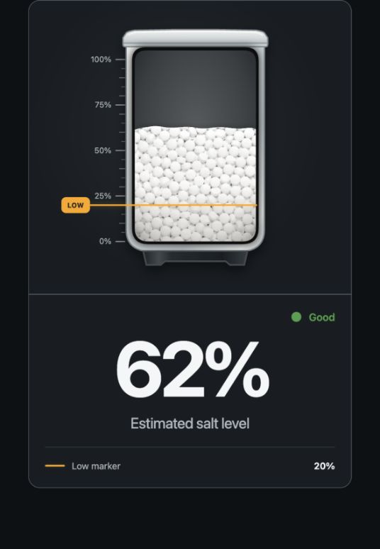

# SaltWatch Card

[](https://github.com/thomasgregg/saltwatch-card/releases/latest)
[](https://github.com/thomasgregg/saltwatch-card/actions/workflows/ci.yml)
[](https://my.home-assistant.io/redirect/hacs_repository/?owner=thomasgregg&repository=saltwatch-card&category=plugin)
[](LICENSE)

### See your water-softener salt level at a glance

SaltWatch Card is the visual Home Assistant companion for
[SaltWatch](https://github.com/thomasgregg/saltwatch). It turns SaltWatch's
estimated salt-level sensor into a detailed tank that is easy to understand
from across the room—no interpreting raw percentages and no guessing when it is
time to refill.



SaltWatch Card is built primarily for the entities provided by the SaltWatch
project, but it can also visualize any Home Assistant sensor that reports a
percentage from 0 to 100.

## Contents

- [Why use it?](#why-use-it)
- [Made for SaltWatch](#made-for-saltwatch)
- [What the states mean](#what-the-states-mean)
- [Installation](#installation)
  - [HACS](#hacs)
  - [Manual installation](#manual-installation)
- [Card options](#card-options)
- [Home Assistant friendly by design](#home-assistant-friendly-by-design)
- [Using another percentage sensor](#using-another-percentage-sensor)
- [Development](#development)

## Why use it?

- **Understand the level instantly.** The salt surface moves with the sensor,
  while the ruler and large percentage make the reading easy to scan.
- **Know when to refill.** A clear orange LOW marker shows the threshold you
  chose in SaltWatch.
- **Spot problems quickly.** Good, low-salt, calibration, and sensor-fault
  states have clear labels and familiar Home Assistant colors.
- **Looks at home in Home Assistant.** The card follows the active light, dark,
  or custom theme and uses native Home Assistant card styling.
- **Fits your dashboard.** It adapts from a wide two-column card to a clean
  mobile layout without losing the tank visualization.
- **Feels like the real tank.** The molded container, granular salt texture,
  uneven surface, scale, and subtle material lighting make the reading more
  tangible than a standard gauge.

## Made for SaltWatch

[SaltWatch](https://github.com/thomasgregg/saltwatch) monitors the salt level in
a water softener and exposes the result to Home Assistant. This card presents
the most important SaltWatch information as one focused visual:

- the estimated salt level;
- the configured low-salt threshold;
- the current SaltWatch health status.

With the standard SaltWatch entity names, the configuration is simply:

```yaml
type: custom:saltwatch-card
entity: sensor.saltwatch_salt_level
status_entity: sensor.saltwatch_salt_status
threshold_entity: number.saltwatch_low_salt_threshold
```

The main `entity` is the only required option. The status and threshold entities
make the experience richer, but the card can derive a useful state without
them.

## What the states mean

| State | What you see | What it tells you |
| --- | --- | --- |
| **Good** | Green status | The reading is available and above the low threshold. |
| **Low salt** | Orange warning | The estimated level has reached the refill threshold. |
| **Calibration required** | Orange calibration symbol | SaltWatch needs calibration before it can provide a trustworthy level. |
| **Sensor fault** | Red fault symbol | SaltWatch cannot currently provide a valid reading. |

When the level is unavailable, the card never leaves an old percentage on
screen as though it were current. The tank switches to an explicit no-reading
state instead.

## Installation

### HACS

[](https://my.home-assistant.io/redirect/hacs_repository/?owner=thomasgregg&repository=saltwatch-card&category=plugin)

Select the button above to open SaltWatch Card directly in HACS, then download
the latest release. If the button cannot find the repository, add it manually:

1. In HACS, open **Custom repositories**.
2. Add `https://github.com/thomasgregg/saltwatch-card` as a **Dashboard**
   repository.
3. Find **SaltWatch Card** in HACS and install it.
4. Reload your Home Assistant dashboard.
5. Add **SaltWatch Card** from the dashboard card picker.

The graphical editor lets you select entities and adjust the main options
without writing YAML.

### Manual installation

1. Download `saltwatch-card.js` from the
   [latest release](https://github.com/thomasgregg/saltwatch-card/releases/latest).
2. Create the directory if needed, then copy the file to
   `/config/www/saltwatch-card/saltwatch-card.js` in Home Assistant. If this is
   the first time you have created `/config/www/`, restart Home Assistant.
3. Open **Settings → Dashboards**, select the three-dot menu, and open
   **Resources**.
4. Add `/local/saltwatch-card/saltwatch-card.js` as a **JavaScript module**.
5. Reload the browser, then add **SaltWatch Card** from the dashboard card
   picker.

The `/config/www/` directory is exposed by Home Assistant under the `/local/`
URL path, which is why the filesystem and resource paths are different.

## Card options

| Option | What it does | Default |
| --- | --- | --- |
| `entity` | Supplies the estimated salt percentage and moves the salt surface. | Required |
| `status_entity` | Supplies SaltWatch's Good, Low Salt, Calibration Required, or Sensor Fault status. | Derived from the level |
| `threshold_entity` | Keeps the orange LOW marker synchronized with SaltWatch's adjustable threshold. | Not set |
| `low_threshold` | Sets a fixed LOW marker when no threshold entity is available. | `20` |
| `show_status` | Shows or hides the status label in the upper-right corner. | `true` |
| `show_low_marker` | Shows or hides the low-marker summary below the percentage. The marker on the tank remains visible. | `true` |
| `display_mode` | Shows the complete card (`both`), only the tank (`tank`), or only the percentage and status (`details`). | `both` |
| `tap_action` | Chooses what happens when the card is tapped. | `more-info` |
| `hold_action` | Chooses what happens when the card is held. | `none` |
| `double_tap_action` | Chooses what happens when the card is double-tapped. | `none` |

### A simpler card

The tank can stand on its own when you want a more visual dashboard:

```yaml
type: custom:saltwatch-card
entity: sensor.saltwatch_salt_level
status_entity: sensor.saltwatch_salt_status
threshold_entity: number.saltwatch_low_salt_threshold
display_mode: tank
```

Or keep the percentage while hiding secondary information:

```yaml
show_status: false
show_low_marker: false
display_mode: details
```

## Home Assistant friendly by design

SaltWatch Card uses Home Assistant's native success, warning, and error theme
colors. Low salt and calibration are orange warnings; red is reserved for an
actual sensor fault. The card also supports Home Assistant's graphical card
editor, keyboard interaction, configurable tap/hold actions, English and German
labels, and responsive Sections dashboards.

The card deliberately stays focused on the tank. Pair it with Home Assistant's
native Tile and Statistics Graph cards when you also want threshold controls,
history, distance, or refill forecasts.

## Using another percentage sensor

SaltWatch Card works with any numeric Home Assistant sensor whose value is a
percentage between 0 and 100:

```yaml
type: custom:saltwatch-card
entity: sensor.my_salt_level
low_threshold: 20
```

Without a status entity, the card automatically shows **Low salt** when the
reading reaches the configured threshold.

## Development

```bash
npm install
npm run dev
```

Open `http://127.0.0.1:5173/demo/` to explore every state, display mode, and
theme. Run the complete test and production build with:

```bash
npm run check
npm run test:e2e
```

## License

[MIT](LICENSE)
