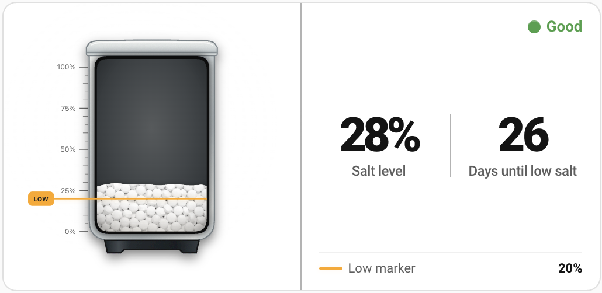
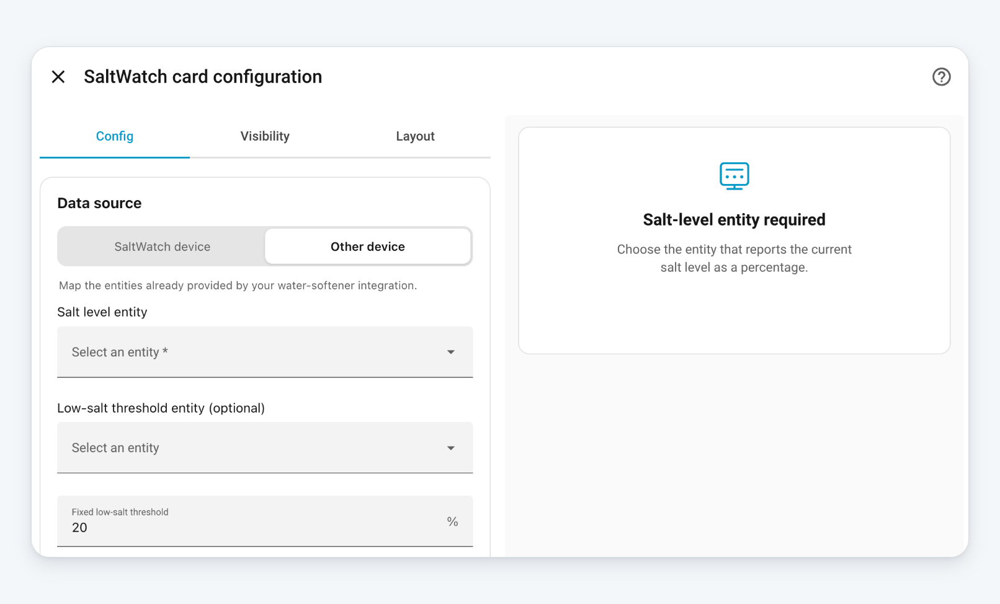

# SaltWatch Card

[](https://github.com/thomasgregg/saltwatch-card/releases/latest)
[](https://github.com/thomasgregg/saltwatch-card/actions/workflows/ci.yml)
[](https://my.home-assistant.io/redirect/hacs_repository/?owner=thomasgregg&repository=saltwatch-card&category=plugin)
[](https://github.com/thomasgregg/saltwatch-card/blob/main/LICENSE)

### See your water-softener salt level at a glance

SaltWatch Card is the visual Home Assistant companion for
[SaltWatch](https://github.com/thomasgregg/saltwatch). It turns SaltWatch's
estimated salt-level sensor into a detailed tank that is easy to understand
from across the room—no interpreting raw percentages. It can also show
SaltWatch's refill forecast, so you know how much salt remains and when the low
threshold is likely to be reached.



SaltWatch Card is designed specifically for devices running the official
SaltWatch firmware. It uses Home Assistant's device and entity registries so
renamed entities and multiple SaltWatch devices remain unambiguous.

## Contents

- [Why use it?](#why-use-it)
- [Made for SaltWatch](#made-for-saltwatch)
- [What the states mean](#what-the-states-mean)
- [Installation](#installation)
  - [HACS](#hacs)
  - [Manual installation](#manual-installation)
- [Graphical editor](#graphical-editor)
  - [Dashboard sizing](#dashboard-sizing)
- [Card options](#card-options)
- [Home Assistant friendly by design](#home-assistant-friendly-by-design)
- [Languages](#languages)

## Why use it?

- **Understand the level instantly.** The salt surface moves with the sensor,
  while the ruler and large percentage make the reading easy to scan.
- **Know when to refill.** A clear orange LOW marker shows the threshold you
  chose in SaltWatch.
- **Look ahead.** Optionally show SaltWatch's estimated days until low salt by
  itself or beside the current level.
- **Understand forecast learning.** When no estimate is ready, the card shows a
  concise reason or progress such as `4 of 7 days collected`.
- **Spot problems quickly.** Good, low-salt, calibration, and sensor-fault
  states have clear labels and familiar Home Assistant colors.
- **Looks at home in Home Assistant.** The card follows the active light, dark,
  or custom theme and uses native Home Assistant card styling.
- **Fits your dashboard.** It adapts from a wide two-column card to a clean
  mobile layout without losing the tank visualization.
- **Feels like the real tank.** The molded container, granular salt texture,
  uneven surface, scale, and subtle material lighting make the reading more
  tangible than a standard gauge.

## Made for SaltWatch

[SaltWatch](https://github.com/thomasgregg/saltwatch) monitors the salt level in
a water softener and exposes the result to Home Assistant. This card presents
the most important SaltWatch information as one focused visual:

- the estimated salt level;
- the estimated days until the low-salt threshold;
- the configured low-salt threshold;
- the current SaltWatch health status.

The graphical editor stores the selected Home Assistant device rather than a
collection of rename-prone entity IDs:

```yaml
type: custom:saltwatch-card
device_id: 01JEXAMPLEHOMEASSISTANTDEVICEID
```

Select the SaltWatch device in the graphical editor; there is normally no need
to find or type the device ID. The card resolves the level, health, threshold,
forecast, and forecast-detail entities from that device at runtime. User-renamed
entity IDs therefore continue to work, and entities from different SaltWatch
devices cannot be combined accidentally.

Use the latest official SaltWatch firmware. The selected device must provide
all six card entities: **Salt Level**, **Salt Status**, **Low Salt Threshold**,
**Estimated Days Until Low Salt**, **Forecast Status**, and **Forecast
Details**. The editor reports missing, duplicate, or disabled entries instead
of silently substituting another entity.

## What the states mean

| State | What you see | What it tells you |
| --- | --- | --- |
| **Initializing** | Neutral hourglass and a striped `?` tank | SaltWatch is waiting for its first trustworthy level. |
| **Good** | Green status | The reading is available and above the low threshold. |
| **Low salt** | Orange warning | The estimated level has reached the refill threshold. |
| **Calibration required** | Orange calibration symbol | SaltWatch needs calibration before it can provide a trustworthy level. |
| **Sensor fault** | Red fault symbol | SaltWatch cannot currently provide a valid reading. |
| **No current reading** | Neutral question-mark symbol and a striped `?` tank | No trustworthy level is currently available, but SaltWatch has not reported a sensor fault. |

When the level is unavailable, the card never leaves an old percentage on
screen as though it were current. The tank switches to an explicit no-reading
state instead.

## Installation

### HACS

[](https://my.home-assistant.io/redirect/hacs_repository/?owner=thomasgregg&repository=saltwatch-card&category=plugin)

Select the button above to open SaltWatch Card directly in HACS, then download
the latest release. If the button cannot find the repository, add it manually:

1. In HACS, open **Custom repositories**.
2. Add `https://github.com/thomasgregg/saltwatch-card` as a **Dashboard**
   repository.
3. Find **SaltWatch Card** in HACS and install it.
4. Reload your Home Assistant dashboard.
5. Add **SaltWatch Card** from the dashboard card picker.

The graphical editor lists detected SaltWatch devices, keeps the everyday
layout choices up front, and groups tap, hold, and double-tap behaviour in a
focused Actions section.

### Manual installation

1. Download `saltwatch-card.js` from the
   [latest release](https://github.com/thomasgregg/saltwatch-card/releases/latest).
2. Create the directory if needed, then copy the file to
   `/config/www/saltwatch-card/saltwatch-card.js` in Home Assistant. If this is
   the first time you have created `/config/www/`, restart Home Assistant.
3. Open **Settings → Dashboards**, select the three-dot menu, and open
   **Resources**.
4. Add `/local/saltwatch-card/saltwatch-card.js` as a **JavaScript module**.
5. Reload the browser, then add **SaltWatch Card** from the dashboard card
   picker.

The `/config/www/` directory is exposed by Home Assistant under the `/local/`
URL path, which is why the filesystem and resource paths are different.

## Graphical editor

The visual editor keeps the most useful settings easy to find and shows every
change immediately in the live preview. Choose a SaltWatch device once; the
card then follows its Home Assistant device relationship instead of relying on
entity names. If required firmware entities are missing or disabled, the editor
lists them explicitly instead of guessing or pairing another device.



Choose the complete, tank-only, or details-only layout visually. In the
complete layout, you can place the tank or the details first. The editor also
lets you choose the displayed values and visible elements without touching
YAML. Tap, hold, and double-tap behavior stays organized in the separate
**Actions** section.

### Dashboard sizing

The card uses automatic height by default. In a Sections dashboard, Home
Assistant's Layout editor also prevents resizing the card below the smallest
readable size for the selected content:

| Selected content | Minimum grid size |
| --- | --- |
| Complete card (tank and details) | 6 columns × 4 rows |
| Tank only | 3 columns × 3 rows |
| Details with one value | 3 columns × 2 rows |
| Details with level and forecast | 6 columns × 2 rows |

These are Home Assistant grid cells, not pixels. Changing the card content or
displayed values updates the resizing limits automatically. The minimums keep
labels and values legible and prevent clipped or overlapping layouts.

## Card options

| Option | What it does | Default |
| --- | --- | --- |
| `device_id` | Selects the SaltWatch device. All required entities are resolved from its Home Assistant registry relationship. | Required |
| `show_status` | Shows or hides the status label in the upper-right corner. | `true` |
| `show_low_marker` | Shows or hides the low-marker summary below the values. The marker on the tank remains visible. | `true` |
| `display_mode` | Shows the complete card (`both`), only the tank (`tank`), or only the values and status (`details`). | `both` |
| `metric_mode` | Shows the current level (`level`), refill forecast (`forecast`), or both values side by side (`both`). | `level` |
| `section_order` | Places the tank first (`tank-first`) or the details first (`details-first`) in the complete layout. | `tank-first` |
| `tap_action` | Chooses what happens when the card is tapped. | `more-info` |
| `hold_action` | Chooses what happens when the card is held. | `none` |
| `double_tap_action` | Chooses what happens when the card is double-tapped. | `none` |

### A simpler card

The tank can stand on its own when you want a more visual dashboard:

```yaml
type: custom:saltwatch-card
device_id: 01JEXAMPLEHOMEASSISTANTDEVICEID
display_mode: tank
```

Or keep the percentage while hiding secondary information:

```yaml
show_status: false
show_low_marker: false
display_mode: details
```

## Home Assistant friendly by design

SaltWatch Card uses Home Assistant's native success, warning, and error theme
colors. Low salt and calibration are orange warnings; red is reserved for an
actual sensor fault. The card also supports Home Assistant's graphical card
editor, keyboard interaction, configurable tap/hold actions, multiple languages,
and responsive Sections dashboards.

## Languages

SaltWatch Card currently supports **English and German**. The card and its
graphical editor automatically follow the language selected in each Home
Assistant user profile and update immediately when that language changes.
German regional variants such as `de-DE` and `de-AT` share the German
translation while keeping their regional number formatting. Unsupported
languages fall back safely to English.

The card deliberately stays focused on SaltWatch, its tank, and its refill timing. Pair it
with Home Assistant's native Tile and Statistics Graph cards when you also want
threshold controls, measurement history, or distance details.

## License

[MIT](LICENSE)
